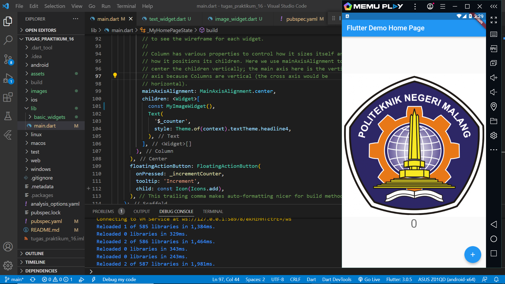

## Praktikum 1 dan 2

A new Flutter project.

## Praktikum 3

Langkah 1 Text Widget

Langkah 2 Image Widget

## Praktikum 4
Langkah 1: Cupertino Button dan Loading Bar

Langkah 2: Floating Action Button (FAB)

Langkah 3: Scaffold Widget

Langkah 4: Dialog Widget

Langkah 5: Input dan Selection Widget

Langkah 6: Date and Time Pickers

